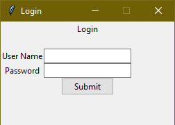

# Tkinter Demo Window Layout
### Sample window and menu to help kickstart the window app development using tkinter with native look and feel

### Requirements
1. [Python 3.x](https://www.python.org/)  

### Demo
Download the script and run login.py file, click on submit button to open main window. Click on edit menu -> add item to view child window.  

### Code
Let us start with import, import tkinter and tkinter.ttk both one by one keeping tkinter.ttk after first statment. This will override tkinter look feel with native window look and feel.   
```python
from tkinter import *
from tkinter.ttk import *
```
Define login class and few fields related to login form.  
```python
class Login(Frame):
    '''
    Login form
    '''
    def __init__(self, master=None):
        '''
        Initialize frame
        '''
        Frame.__init__(self, master)        
        self.grid()        

        self.master.title('Login')

        self.winLabel = Label(master, text="Login")
        self.winLabel.grid(row=1, column=1)
        
        self.winLabel = Label(master)
        self.winLabel.grid(row=2, column=1)        

        self.nunameLabel = Label(master, text="User Name")
        self.nunameLabel.grid(row=4, column=0)

        self.nuname = StringVar()
        self.nunameEntry = Entry(master, textvariable=self.nuname)
        self.nunameEntry.grid(row=4, column=1)
                        
        self.npwdLabel = Label(master, text="Password")
        self.npwdLabel.grid(row=5, column=0)

        self.npwd = StringVar()
        self.npwdEntry = Entry(master, show='*', textvariable=self.npwd)
        self.npwdEntry.grid(row=5, column=1)               

        self.button = Button(master, text = "Submit", command="")
        self.button.grid(row = 6, column = 1)  
```
Define main method and start login window with set window size and location in middle on screen
```python
if __name__ == '__main__':    
    loginRoot = Tk()
    # set default size
    loginRoot.geometry("250x150+300+300")
    # disable maximize option
    loginRoot.resizable(0,0)
    # set position in middle of screen
    loginRoot.eval('tk::PlaceWindow . center')    
    Login(loginRoot)    
    loginRoot.mainloop()  
```
Post login, to open new main window, change command of submit button with below code.  
```python
self.button = Button(master, text = "Submit", command=self.openMainWindow)
```
and define function without any logic.  
```python
def openMainWindow(self):
    pass
```
Now let us work on writing code for main window with menu bar, copy and paste below code in new file named main_window.py and save it.
```python
from tkinter import *
from tkinter.ttk import *

class MainWindow(Frame):
    '''
    main window with menu bar
    '''

    def __init__(self, master=None):
        Frame.__init__(self, master)
        self.grid()                

        self.master.title('Main Window')

        menubar = Menu(self.master)
        self.master.config(menu=menubar)

        fileMenu = Menu(menubar)
        fileMenu.add_command(label="Exit", command=self.onExit)
        menubar.add_cascade(label="File", menu=fileMenu)   

        editMenu = Menu(menubar)
        editMenu.add_command(label="Add Item", command=self.subWindow)
        menubar.add_cascade(label="Edit", menu=editMenu)

        helpMenu = Menu(menubar)
        helpMenu.add_command(label="About", command="")
        menubar.add_cascade(label="Help", menu=helpMenu)                
        

    def onExit(self):
        '''
        on click exit close window and exit
        '''        
        self.master.destroy()

    def subWindow(self):
        '''
        sub window using toplevel and set focus on child and disable access to parent window
        '''
        sub = Toplevel(self)
        sub.title("Sub Window")
        sub.geometry("600x300+100+100")        
        sub.focus_force()
        sub.grab_set()
        sub.transient(self)

        self.nunameLabel = Label(sub, text="User Name")
        self.nunameLabel.grid(row=4, column=0)

        self.nuname = StringVar()
        self.nunameEntry = Entry(sub, textvariable=self.nuname)
        self.nunameEntry.grid(row=4, column=1)        
        
        sub.mainloop()
```
Now open login.py file and add below code in function openMainWindow  
```python
self.master.destroy()
mainroot = Tk()    
# set size of main window in maximize state
mainroot.state('zoomed')
MainWindow(mainroot)    
mainroot.mainloop() 
```
Thats it, we are done, run login.py file and you should see screen  
  
Click on submit button and you should see below screen.  

